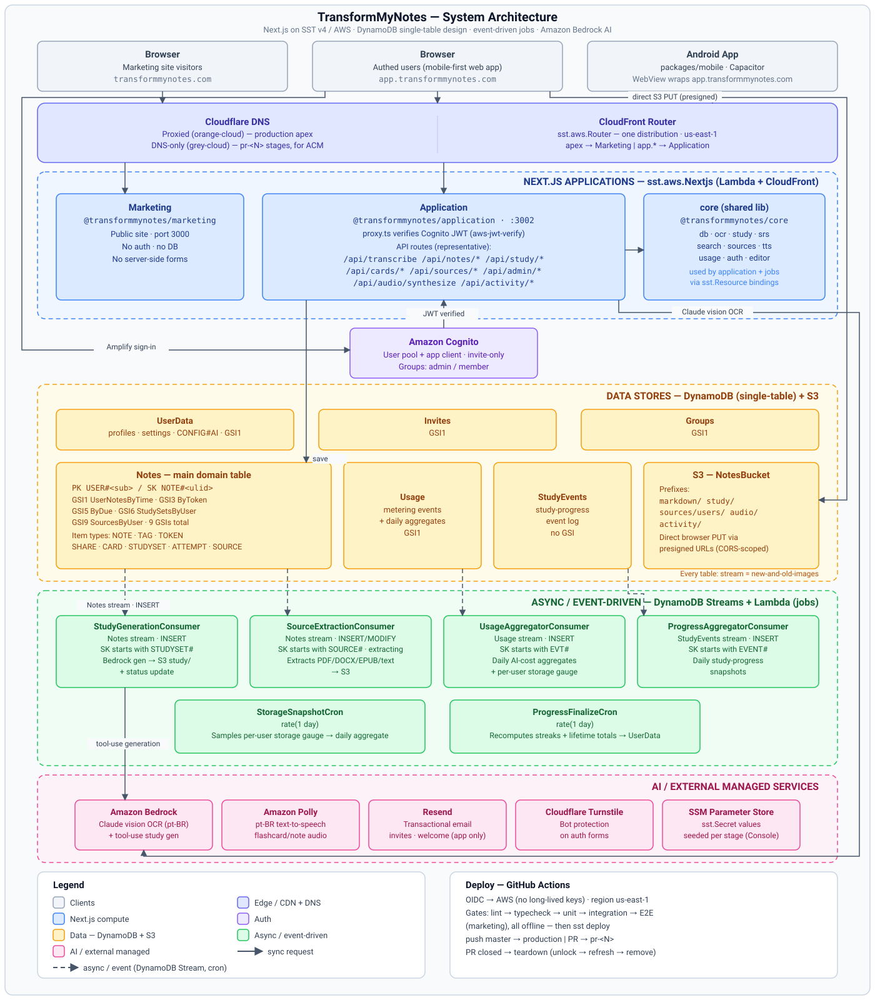

# TransformMyNotes

TransformMyNotes is a mobile-first web application that digitizes handwritten study notes. The core
workflow is: photograph a page → Amazon Bedrock (Claude vision) transcribes the handwriting
(optimized for Brazilian Portuguese) into Markdown → review and edit in a Notion-like
(TipTap/ProseMirror) block editor → save into a personal, full-text-searchable notebook. Access is
invite- and approval-gated with an admin panel. The application also supports courses and groups,
a spaced-repetition review deck, shared notes, and an AI study-material suite (flashcards, quizzes,
summaries, and study guides) generated from notes and ingested documents.

<p align="center">
  
</p>
<p align="center"><sub>See <a href="#architecture">Architecture</a> for detail.</sub></p>

---

## Features

- **Capture and OCR** — photograph a handwritten page; the image is uploaded via a presigned S3 URL
  and transcribed by Amazon Bedrock Converse (Claude vision), with strong support for Brazilian
  Portuguese handwriting.
- **Notion-like block editor** — review and edit the transcribed Markdown in a TipTap/ProseMirror
  block editor before saving.
- **Full-text search** — per-user token-index items in DynamoDB back prefix-match search across all
  saved notes.
- **Tags and library** — organize notes with tags; browse the personal notebook library sorted
  newest-first.
- **Sharing and groups** — share individual notes with other users; organize users into courses or
  groups.
- **Spaced-repetition review deck** — schedule flashcards for review using a spaced-repetition
  algorithm; cards are surfaced oldest-due-first via a DynamoDB GSI.
- **AI study materials** — generate flashcard decks, auto-graded quizzes, summaries, and study
  guides from one note or across an entire notebook using Amazon Bedrock tool-use.
- **Document and web-article sources** — ingest PDF, DOCX, EPUB, and plain-text files, or fetch
  web articles, as source material for AI generation.
- **Brazilian-Portuguese TTS audio** — generate audio for flashcards and notes via Amazon Polly.
- **Admin panel** — invite-only registration; admin users manage invites, approve accounts, and
  configure AI generation settings at runtime.
- **Android app** — a Capacitor shell wraps `app.transformmynotes.com` in a native Android WebView
  for Play Store distribution.

---

## Tech stack

| Layer | Technology |
|---|---|
| Framework | Next.js App Router (Node runtime) |
| Infrastructure-as-code | SST v4 (Pulumi) |
| Hosting | AWS CloudFront + Lambda@Edge, `us-east-1` |
| Storage | DynamoDB (single-table) + S3 (note bodies, study-set blobs) |
| Auth | AWS Cognito (Amplify Auth client, `aws-jwt-verify` server) |
| AI / OCR | Amazon Bedrock Converse — Claude vision for transcription, tool-use for study materials |
| TTS | Amazon Polly |
| Email | Resend (transactional — invites, welcome) |
| DNS / CDN | Cloudflare (DNS-only for PR stages) |
| CI/CD | GitHub Actions + OIDC → AWS |

Production URLs: `transformmynotes.com` (marketing) · `app.transformmynotes.com` (application).

---

## Monorepo layout

npm workspaces monorepo; all packages live under `packages/`.

```
packages/
  marketing/    @transformmynotes/marketing — public Next.js site (port 3000)
  application/  @transformmynotes/application — authed Next.js app (port 3002, Cognito)
  core/         @transformmynotes/core — shared DynamoDB client + key builders
  scripts/      one-off SST-shell scripts (sst shell tsx)
  mobile/       @transformmynotes/mobile — Capacitor Android shell (wraps app.transformmynotes.com)

infra/          SST resource definitions
  secrets.ts    sst.Secret declarations
  router.ts     single sst.aws.Router (shared by both Next.js apps)
  auth.ts       Cognito user pool + app client
  marketing.ts  marketing Next.js site attachment
  application.ts authed Next.js app + IAM grants
  db.ts         DynamoDB table + GSI definitions (shared by application and jobs)
  jobs.ts       background Lambda jobs

scripts/        repo-level Node/tsx utilities (SST secrets management, CI vars)
```

`infra/` modules are loaded in order by `sst.config.ts`: `secrets → router → auth → marketing →
application → jobs`. The `core` package is consumed by `application` via `sst.Resource` bindings
and is never imported by `marketing`. The `mobile` package has no SST entrypoint and is excluded
from the main deploy; Android release builds run via `.github/workflows/android.yml`.

---

## Getting started / local development

**Prerequisites:** Node 22, npm (included with Node).

```bash
git clone https://github.com/jasonp2323/transformmynotes.git
cd transformmynotes
npm ci
```

**Start the marketing site** (no auth, no DB):
```bash
npm run dev:marketing   # http://localhost:3000
```

**Start the application** (Cognito-authed, DynamoDB-backed):
```bash
npm run dev:application # http://localhost:3002
```

The application runs fully offline locally — dynalite (in-memory DynamoDB) replaces AWS DynamoDB,
and `cognito-local` replaces the Cognito service, so you never need live AWS credentials during
development. See the **"Local UI / browser testing"** section in `CLAUDE.md` for the complete setup
recipe (env vars, table seeding, headless sign-in token minting).

---

## Common commands

Run all commands from the repo root.

```bash
# Development
npm run dev:marketing          # marketing site on :3000
npm run dev:application        # authed app on :3002

# Quality gates (all required to pass before merge)
npm run lint                   # ESLint across all workspaces
npm run typecheck              # TypeScript across all workspaces

# Tests
npm run test:unit              # pure unit tests — no AWS, no SST stage (gates CI)
npm run test:integration       # dynalite integration tests — no AWS, no SST stage (gates CI)
npm run test:e2e               # Playwright E2E against offline marketing site (gates CI)
npm run test:e2e:application   # Playwright E2E against offline authed app — opt-in ([E2E] tag)

# SST
npx sst deploy --stage <stage>           # deploy a named stage to AWS
npx sst remove --stage <stage>           # tear down a stage
npx sst shell --stage <stage> <cmd>      # run any command with sst.Resource bindings injected
npx sst secret set <NAME> <value> --stage <stage>  # seed an SST secret for a stage
```

**Test coverage:**
- `test:unit` — pure logic (parsers, key builders, data transforms). No AWS.
- `test:integration` — real DynamoDB client against dynalite; exercises GSI writes + reads. No AWS.
- `test:e2e` — Playwright drives the marketing Next.js app offline. Runs on every PR.
- `test:e2e:application` — Playwright drives the Cognito-authed app offline (dynalite + cognito-local).
  Opt-in on `master` pushes: runs only when the head commit message contains `[E2E]`, and gates
  the production deploy when it does.

---

## Architecture

### Routing

A single `sst.aws.Router` (defined in `infra/router.ts`) fronts both Next.js apps via one
CloudFront distribution. The marketing site attaches at the apex; the application attaches at
`app.transformmynotes.com`. Do not add a second Router.

Ephemeral PR stages get their own CloudFront distributions at `pr-<N>.pr.transformmynotes.com`
with DNS-only (grey-cloud) Cloudflare records so ACM can issue the cert directly.

### Persistence

DynamoDB uses a single-table design. All table and GSI definitions live in `infra/db.ts`. All
data access goes through `packages/core/src/db`:

- `client.ts` — exports the `ddb` DocumentClient and `TableNames` map.
- `keys.ts` — all PK/SK/GSI key builders. Never construct key strings inline in route handlers.

Note bodies (Markdown) and study-set blobs are stored in S3; DynamoDB holds only metadata.

### Auth

`packages/application/proxy.ts` is the auth middleware. It verifies the Cognito-issued JWT with
`aws-jwt-verify` (pool id and client id from `sst.Resource` bindings) and protects authed routes
(`/dashboard`, `/account`, etc.). Client-side sign-in uses AWS Amplify Auth. The pool id and
app-client id are public values exposed via `NEXT_PUBLIC_` env vars — there is no secret API key
for Cognito.

Production owns its Cognito pool. Ephemeral `pr-<N>` stages reference a shared dev pool (pool id
passed as the `DEV_COGNITO_USER_POOL_ID` GitHub Actions repository variable). See
`docs/runbooks/shared-dev-cognito-pool.md` for one-time setup.

### OCR pipeline

1. User photographs a page in the app; the client requests a presigned S3 upload URL.
2. The image is uploaded directly from the browser to S3.
3. `POST /api/transcribe` calls Amazon Bedrock Converse with the image (Claude vision) and returns
   Markdown.
4. The user reviews and edits the Markdown in the TipTap block editor, then saves.

### AI study materials

Study-material generation (flashcards, quizzes, summaries, study guides) uses Amazon Bedrock
tool-use to produce typed JSON. Results are stored as `STUDYSET` items in DynamoDB and their
bodies in S3. Per-user runtime AI settings (model, prompt overrides) are configurable by admins.

---

## Deployment / CI-CD

Four GitHub Actions workflows under `.github/workflows/`:

| Workflow | Trigger | Action |
|---|---|---|
| `deploy.yml` | push to `master`; PR open/sync/reopen | Gates (lint, typecheck, unit, integration, E2E) then deploys `production` or `pr-<N>` |
| `teardown.yml` | PR closed | Removes the `pr-<N>` stage (`sst unlock → refresh → remove`) |
| `release.yml` | push to `master`; `workflow_dispatch` | release-please tags `vX.Y.Z`; Claude writes GitHub Release notes |
| `android.yml` | `mobile-v*` tag push; `workflow_dispatch` | Builds the Capacitor Android release APK/AAB |

- Every gate (lint, typecheck, unit, integration, marketing E2E) runs **before** AWS credentials are
  configured, so they block deployment without needing cloud access.
- Add `[skip deploy]` to the commit message (production path) or PR title (`pr-<N>` path) to skip
  the SST deploy steps while still running all quality gates. This differs from `[skip ci]`, which
  skips everything.
- Deployment uses GitHub OIDC (`aws-actions/configure-aws-credentials@v4`) — no long-lived AWS
  access keys are stored in GitHub.
- SST application secrets are stored in AWS SSM Parameter Store and seeded with
  `npx sst secret set`.
- Region is pinned to `us-east-1` (required for CloudFront ACM certificate issuance).

---

## Project planning and docs

| Resource | Location |
|---|---|
| Milestone specs | [`docs/milestones/`](docs/milestones/) — one `M*.md` per milestone, mirrored into each epic issue |
| Delivery roadmap, dependency graph, Gantt | [`docs/milestones/ROADMAP.md`](docs/milestones/ROADMAP.md) |
| Parallel-dispatch (wave) plan | [`docs/milestones/PARALLEL-DISPATCH.md`](docs/milestones/PARALLEL-DISPATCH.md) |
| GitHub Project board | [Transform My Notes — Project #5](https://github.com/users/jasonp2323/projects/5) |
| Runbooks | [`docs/runbooks/`](docs/runbooks/) — operational recipes (shared dev Cognito pool, admin bootstrap, E2E setup, production launch) |
| Contributor conventions | [`CLAUDE.md`](CLAUDE.md) — architecture details, branch naming, commit style, testing rules, secret management, CI/CD internals |
