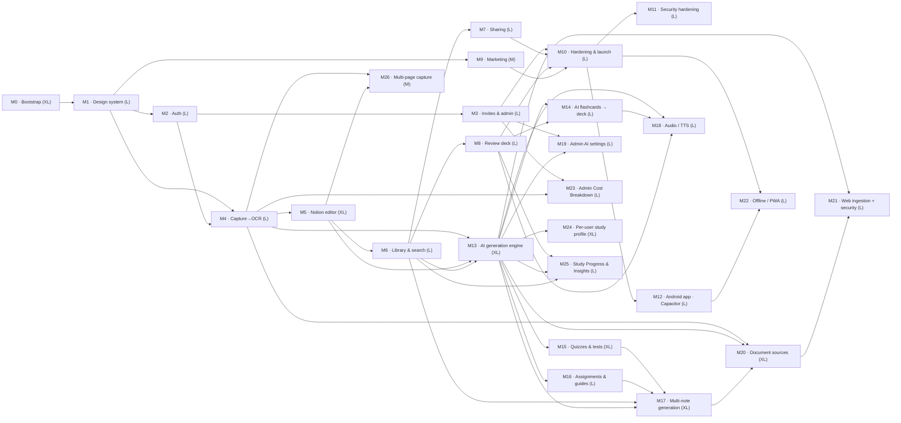
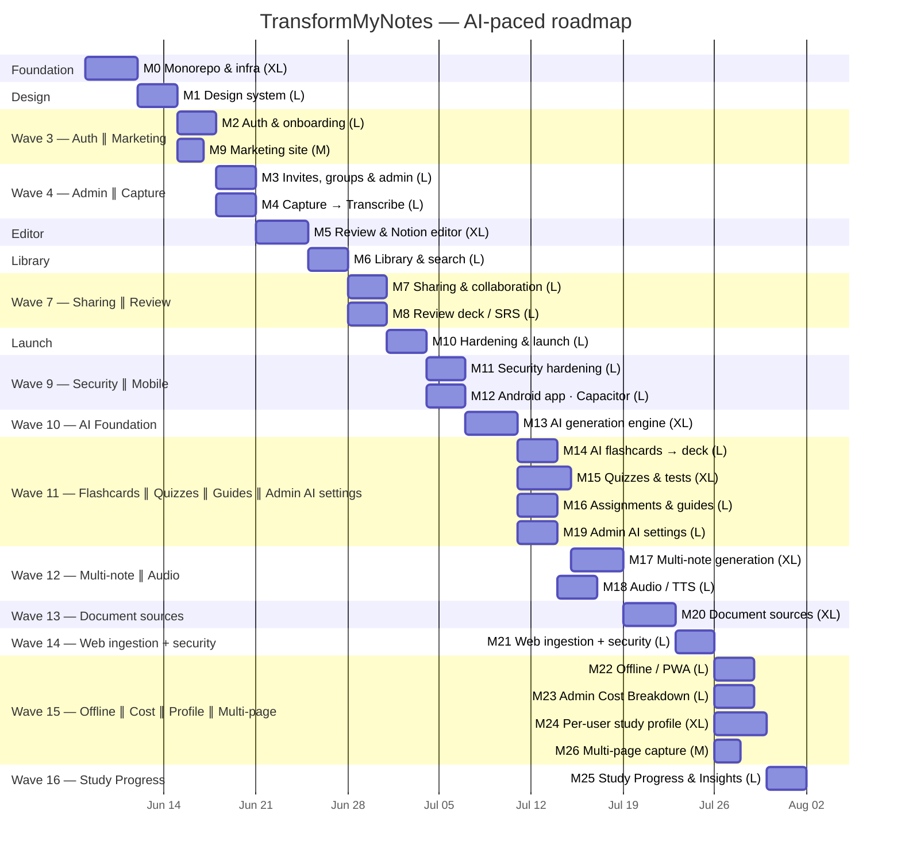

# TransformMyNotes — Delivery Roadmap

AI-paced schedule for the 27 milestones. Durations are compressed for agent-driven
implementation (an `L` milestone is planned at ~3 days, `XL` at ~4, `M` at ~2), not the weeks a
human team would take. Where milestones don't depend on each other they are scheduled **in
parallel** and tagged with the same **Wave** — those can be dispatched to separate agents at the
same time without stepping on each other.

This file is the source of truth; it's mirrored onto **Project board #5**
(https://github.com/users/jasonp2323/projects/5) via the `Wave`, `Start date`, and `Target date`
fields, and onto each GitHub **milestone's due date**.

- **Window:** 2026-06-08 → 2026-08-04 (~57 calendar days; M11/M12 post-launch run in one parallel wave; M13–M21 post-launch AI study-material program begins Jul 7; M20/M21 source & web-ingestion extension runs Waves 13–14); M22–M26 post-program leaf milestones run Waves 15–16 (Jul 26 → Aug 1)
- **If run fully sequentially** it would be ~64 days; the parallel waves save ~1.5 weeks.

## Dependency graph

> **Post-launch milestones (M11–M12)** run after the production cutover in M10. They are
> independent of each other — Security (auth/app hardening) and the Android wrapper touch
> different surfaces — so they share a wave and can be dispatched in parallel.

> **Post-launch AI study-material program (M13–M21)** begins after M11/M12. M13 is the shared
> foundation; M14/M15/M16 branch off it in parallel (each covers a different material type);
> M17 and M18 can then run in parallel once their respective dependencies are met;
> M20 (document sources) follows M17 alone in Wave 13; M21 (web ingestion + security hardening)
> follows M20 alone in Wave 14.

> **Post-program leaf milestones (M22–M26)** all have their prerequisites fully shipped by the end
> of Wave 14. M22/M23/M24/M26 are mutually orthogonal and run in parallel in Wave 15 (Jul 26–29):
> M22 adds a Workbox PWA shell (touches `packages/application` infra only), M23 adds a new
> `Usage` table + stream aggregator (entirely new infra surface), M24 extends the UserData/UserProfile
> item with per-user study-profile fields and a settings UI, and M26 adds a Multi-page capture
> toggle + `POST /api/transcribe/batch` route (additive change to the Notes item, no new GSI).
> M25 is isolated in Wave 16 (Jul 30–Aug 1) to remove two merge couplings: M23 and M25 would
> each add a new dedicated table + stream aggregator (light coupling on `infra/db.ts`/`infra/jobs.ts`),
> and M24 and M25 would both write the UserData/UserProfile item (M24 adds profile fields, M25
> adds lifetime counters + streak). Isolating M25 leaves M22/M23/M24/M26 fully orthogonal in Wave 15.

## Schedule (Gantt)

## Wave-by-wave dispatch plan

Each **Wave** is a set of milestones that can be worked **at the same time**. Finish a wave (and
its gates) before starting the next, because the next wave depends on it. Milestones sharing a
wave row are independent — dispatch one agent per milestone in parallel.

| Wave | Milestones (parallel) | Dates | Why they're safe in parallel |
|---|---|---|---|
| **1** | **M0** | Jun 8–11 | Foundation; nothing else can start until the monorepo + infra + CI exist. |
| **2** | **M1** | Jun 12–14 | The design system gates every UI surface; do it once, alone. |
| **3** | **M2** ∥ **M9** | Jun 15–17 | Auth (app) and Marketing (apex) are different packages with no shared code — `packages/application` vs `packages/marketing`. |
| **4** | **M3** ∥ **M4** | Jun 18–20 | Both need auth (M2). Admin panel (invites/groups) and Capture→OCR touch different routes/tables; coordinate only on the shared `UserData`/`Groups` keys from M2/M3. |
| **5** | **M5** | Jun 21–24 | The Notion editor builds directly on M4's transcription output; single focused track. |
| **6** | **M6** | Jun 25–27 | Library + search depend on the saved-note shape from M5. |
| **7** | **M7** ∥ **M8** | Jun 28–30 | Both extend the M6 note model independently — Sharing adds `SHARE` items + a recipient GSI; Review deck adds `CARD` items + a due GSI. No overlap beyond reading a saved note. |
| **8** | **M10** | Jul 1–3 | Hardening/launch needs everything merged; run last, alone. |
| **9** | **M11** ∥ **M12** | Jul 4–6 | Post-launch. Security hardening (Turnstile/headers/scanning on the app) and the Android Capacitor wrapper touch different surfaces and don't share code — safe in parallel. Both depend only on the launched production app (M10). |
| **10** | **M13** | Jul 7–10 | AI generation engine is the shared foundation for all study-material types; must be established alone before M14/M15/M16 can branch off it. |
| **11** | **M14** ∥ **M15** ∥ **M16** ∥ **M19** | Jul 11–14 | All four depend only on M13 (M19 also needs M3, already done). M14/M15/M16 build different material-type code paths — flashcards extend M8's CARD model, quizzes add MCQ/short-answer attempt logic, guides/summaries add new STUDYSET types — no shared files beyond the M13 `generate` wrapper. M19 builds the admin-settings surface (`CONFIG#AI` item + `resolveAiConfig()` resolver) — a different DynamoDB key shape and a different set of admin routes — so the only shared touchpoint is the `resolveAiConfig()` resolver introduced in M13, which M19 writes and M14/M15/M16 call read-only. |
| **12** | **M17** ∥ **M18** | Jul 15–18 | Independent concerns: M17 generalises input scope from single-note to notebook-wide (map-reduce synthesis, note-set picker), while M18 adds Polly TTS audio (S3 cache, audio player). Different tables, routes, and AWS services — no overlap. |
| **13** | **M20** | Jul 19–22 | Document-sources layer depends on M17's map-reduce plumbing (large-book chunking reuses it); runs alone because it introduces `SOURCE#` entity + GSI7 + `resolveSourceText()` normalization — the foundation M21 builds on. |
| **14** | **M21** | Jul 23–25 | Web ingestion + SSRF/prompt-injection hardening depends entirely on M20's `SOURCE#` abstraction and `resolveSourceText()`. Runs alone — security-sensitive surface, no benefit from parallelism with other active work. |
| **15** | **M22** ∥ **M23** ∥ **M24** ∥ **M26** | Jul 26–29 | All four prerequisites (M10/M12, M3/M4, M13, M4/M5) are shipped by end of Wave 14. M22 adds a Workbox PWA shell (infra/service-worker only); M23 adds a new `Usage` table + stream aggregator (entirely new infra surface, no shared-GSI hazard); M24 extends the UserData/UserProfile item with per-user study-profile fields + AI-environment settings UI; M26 adds a Multi-page capture toggle + `POST /api/transcribe/batch` (additive NOTE# item field, no new GSI). No two of these touch the same table schema, route namespace, or component tree — safe in parallel. |
| **16** | **M25** | Jul 30–Aug 1 | Isolated from Wave 15 to remove two couplings: M23 and M25 each add a new dedicated table + stream aggregator (light merge coupling on `infra/db.ts`/`infra/jobs.ts`), and M24 and M25 both write the UserData/UserProfile item (M24 adds profile fields, M25 adds lifetime counters + current streak). Isolating M25 into Wave 16 eliminates both couplings, leaving Wave 15 fully orthogonal. |

### Parallelization notes / light coupling to watch
- **M3 ∥ M4 (Wave 4):** both add DynamoDB access patterns. Keep new key builders in
  `packages/core/src/db/keys.ts` in separate, clearly-named functions so the two agents don't
  collide on that file — merge order doesn't matter if each appends its own builders + tests.
- **M7 ∥ M8 (Wave 7):** both hang new item types off the Notes table from M5/M6. They add
  *different* GSIs (`ByRecipient` vs `ByDue`); if both must add a GSI to the same table in
  `infra/db.ts`, land one PR, rebase the other (a single GSI-add per deploy avoids the
  "index already exists" SST/Pulumi hazard called out in CLAUDE.md).
- **M2 ∥ M9 (Wave 3):** zero coupling — marketing has no auth/DB. Fully independent.
- **M14 ∥ M15 ∥ M16 ∥ M19 (Wave 11):** M14/M15/M16 all call the M13 `generate` wrapper (read-only dependency). M14 writes new `CARD#` items (extends M8's GSI3); M15 writes `ATTEMPT#` items (new GSI6); M16 writes new STUDYSET types — different items, different GSIs, no collision. M19 introduces the `CONFIG#AI` key + `resolveAiConfig()` resolver; M14/M15/M16 call it read-only, so they can land before or after M19 without conflict.
- **M17 ∥ M18 (Wave 12):** fully orthogonal. M17 adds note-set picker UI + map-reduce generation routes; M18 adds Polly TTS Lambda + audio player component. Different routes, different AWS services, no shared state.
- **M20 (Wave 13):** runs alone. Introduces the `SOURCE#` entity + GSI7 + `resolveSourceText()` normalization layer; multi-format parsers (PDF/DOCX/EPUB/TXT/MD); generalizes `STUDYSET.sourceRefs`. M21 depends on this entire surface.
- **M21 (Wave 14):** runs alone. Builds the URL-fetch path on top of M20's `SOURCE#` model; adds `assertUrlSafe`/`safeFetch` SSRF guards and prompt-injection data-wrapping. Security-critical — isolated wave keeps the review surface small.
- **M22 ∥ M23 ∥ M24 ∥ M26 (Wave 15) / M25 (Wave 16):** M22 (Workbox PWA shell) and M26 (Multi-page capture toggle + batch route) are fully isolated surface changes. M23 (Admin Cost Breakdown) and M24 (Per-user study profile) are also orthogonal in Wave 15: M23 introduces a brand-new `Usage` table + stream aggregator (no overlap with any existing table or UI surface), while M24 writes per-user profile fields + a settings UI on the existing UserData item — different key shapes, different admin/settings routes, no collision. **Two couplings that would arise if M25 joined Wave 15 are why it is isolated in Wave 16:** (1) M23 and M25 both add a new dedicated DynamoDB table + stream aggregator Lambda, creating a light merge coupling on `infra/db.ts`/`infra/jobs.ts`; (2) M24 and M25 both write the UserData/UserProfile item — M24 adds per-user profile/AI-environment fields, M25 adds lifetime counters + current-streak — which would require careful merge ordering. Running M25 alone in Wave 16 (after M24 lands) removes both hazards and makes all five milestones safe to ship.

## Per-milestone detail

| # | Milestone | Size | Wave | Start | Target | Depends on | Parallel with |
|---|---|---|---|---|---|---|---|
| M0 | Monorepo & infra bootstrap | XL | 1 | Jun 8 | Jun 11 | — | — |
| M1 | Design-system port | L | 2 | Jun 12 | Jun 14 | M0 | — |
| M2 | Auth & onboarding | L | 3 | Jun 15 | Jun 17 | M0, M1 | M9 |
| M9 | Marketing site | M | 3 | Jun 15 | Jun 16 | M0, M1 | M2 |
| M3 | Invites, groups & admin panel | L | 4 | Jun 18 | Jun 20 | M2 | M4 |
| M4 | Capture → Transcribe (Bedrock OCR) | L | 4 | Jun 18 | Jun 20 | M1, M2 | M3 |
| M5 | Review & Notion-like editor | XL | 5 | Jun 21 | Jun 24 | M4 | — |
| M6 | Notebook library & full-text search | L | 6 | Jun 25 | Jun 27 | M5 | — |
| M7 | Sharing & collaboration | L | 7 | Jun 28 | Jun 30 | M6 | M8 |
| M8 | Review deck / spaced repetition | L | 7 | Jun 28 | Jun 30 | M6 | M7 |
| M10 | Hardening & launch | L | 8 | Jul 1 | Jul 3 | all prior | — |
| M11 | Security hardening | L | 9 | Jul 4 | Jul 6 | M2, M3, M10 | M12 |
| M12 | Android app · Capacitor | L | 9 | Jul 4 | Jul 6 | M10 | M11 |
| M13 | AI generation engine & foundation | XL | 10 | Jul 7 | Jul 10 | M4, M5, M6 | — |
| M14 | AI flashcards → review deck | L | 11 | Jul 11 | Jul 13 | M13, M8 | M15, M16, M19 |
| M15 | Quizzes & tests (auto-graded) | XL | 11 | Jul 11 | Jul 14 | M13 | M14, M16, M19 |
| M16 | Assignments, summaries & study guides | L | 11 | Jul 11 | Jul 13 | M13 | M14, M15, M19 |
| M19 | Admin AI settings — runtime-configurable generation | L | 11 | Jul 11 | Jul 13 | M3, M13 | M14, M15, M16 |
| M17 | Multi-note & notebook-wide generation | XL | 12 | Jul 15 | Jul 18 | M13, M15, M16, M6 | M18 |
| M18 | Audio for flashcards & notes (TTS) | L | 12 | Jul 15 | Jul 17 | M8, M13, M14 | M17 |
| M20 | Document sources — PDF / DOCX / EPUB / text | XL | 13 | Jul 19 | Jul 22 | M4, M13, M17 | — |
| M21 | Web article ingestion + AI security hardening | L | 14 | Jul 23 | Jul 25 | M13, M20 | — |
| M22 | Offline support — PWA service-worker app shell, offline read cache, offline mutations + sync | L | 15 | Jul 26 | Jul 29 | M10, M12 | M23, M24, M26 |
| M23 | Admin Cost Breakdown — per-user AI-token + S3-storage metering; new `Usage` table + stream aggregator | L | 15 | Jul 26 | Jul 29 | M3, M4 | M22, M24, M26 |
| M24 | Per-user study profile & AI environment — "Learner context" prompt layer + profile/settings UI | XL | 15 | Jul 26 | Jul 29 | M13 | M22, M23, M26 |
| M26 | Multi-page note capture — Single/Multi toggle + page tray; `POST /api/transcribe/batch`; `stitchPages()` | M | 15 | Jul 26 | Jul 28 | M4, M5 | M22, M23, M24 |
| M25 | Study Progress & Insights — per-user `/progress` dashboard; new `StudyEvents` table + rollup aggregator + nightly cron | L | 16 | Jul 30 | Aug 1 | M8, M13, M5, M6 (soft: M15) | — |

> Critical path (longest dependent chain): **M0 → M1 → M2 → M4 → M5 → M6 → M8 → M10 → {M11 ∥ M12} → M13 → M15 → M17 → M20 → M21**.
> Shortening any of these directly shortens the whole project; M3, M9, M7, M14, M16, M18, M19, M22, M23, M24, M25, and M26 have slack.
> The AI study-material program adds five waves after launch: M13 alone (Wave 10), then M14/M15/M16/M19 in parallel
> (Wave 11), then M17/M18 in parallel (Wave 12), then M20 alone (Wave 13), then M21 alone (Wave 14) —
> so nine milestones add only ~18 days, not ~34.

## Sub-tasks on the timeline

Every milestone's **sub-issues are also dated** — each is scheduled *within* its milestone's
window, staggered by order (the `M*.1` data-model/scaffold tasks start first; the `*.N`
tests/E2E tasks land at the milestone's target date). So on the Roadmap, expanding a milestone
shows its ~7–10 sub-tasks nested under the epic bar, and the board's `Wave` filter still pulls the
epic **and** all its sub-tasks together for parallel dispatch. Sub-tasks within one milestone are
largely parallel among themselves (one agent can take several), so their bars intentionally
overlap — they share the milestone's start/finish, not a strict internal waterfall.

## Viewing this on the board

The Project's **Roadmap** view renders these as timeline bars. If it isn't already, set the
Roadmap view's date fields to **Start date → Target date**, and optionally **Group by: Wave** to
see the parallel batches stacked. The board-level `Wave` field also lets you filter
(`Wave: "4 · Admin ∥ Capture"`) to pull exactly the issues for the agents you're about to dispatch.
