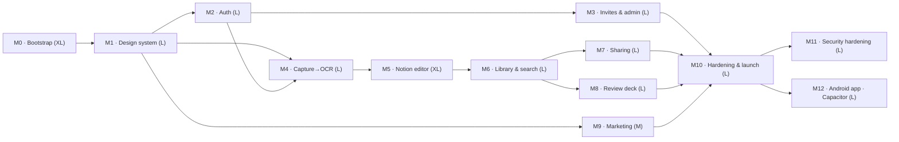
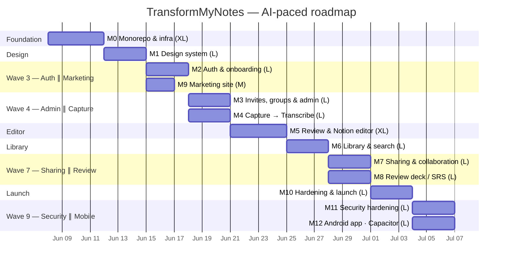

# TransformMyNotes — Delivery Roadmap

AI-paced schedule for the 13 milestones. Durations are compressed for agent-driven
implementation (an `L` milestone is planned at ~3 days, `XL` at ~4, `M` at ~2), not the weeks a
human team would take. Where milestones don't depend on each other they are scheduled **in
parallel** and tagged with the same **Wave** — those can be dispatched to separate agents at the
same time without stepping on each other.

This file is the source of truth; it's mirrored onto **Project board #5**
(https://github.com/users/jasonp2323/projects/5) via the `Wave`, `Start date`, and `Target date`
fields, and onto each GitHub **milestone's due date**.

- **Window:** 2026-06-08 → 2026-07-06 (~29 calendar days; M11/M12 post-launch run in one parallel wave)
- **If run fully sequentially** it would be ~36 days; the parallel waves save ~1 week.

## Dependency graph

> **Post-launch milestones (M11–M12)** run after the production cutover in M10. They are
> independent of each other — Security (auth/app hardening) and the Android wrapper touch
> different surfaces — so they share a wave and can be dispatched in parallel.

## Schedule (Gantt)

## Wave-by-wave dispatch plan

Each **Wave** is a set of milestones that can be worked **at the same time**. Finish a wave (and
its gates) before starting the next, because the next wave depends on it. Milestones sharing a
wave row are independent — dispatch one agent per milestone in parallel.

| Wave | Milestones (parallel) | Dates | Why they're safe in parallel |
|---|---|---|---|
| **1** | **M0** | Jun 8–11 | Foundation; nothing else can start until the monorepo + infra + CI exist. |
| **2** | **M1** | Jun 12–14 | The design system gates every UI surface; do it once, alone. |
| **3** | **M2** ∥ **M9** | Jun 15–17 | Auth (app) and Marketing (apex) are different packages with no shared code — `packages/application` vs `packages/marketing`. |
| **4** | **M3** ∥ **M4** | Jun 18–20 | Both need auth (M2). Admin panel (invites/groups) and Capture→OCR touch different routes/tables; coordinate only on the shared `UserData`/`Groups` keys from M2/M3. |
| **5** | **M5** | Jun 21–24 | The Notion editor builds directly on M4's transcription output; single focused track. |
| **6** | **M6** | Jun 25–27 | Library + search depend on the saved-note shape from M5. |
| **7** | **M7** ∥ **M8** | Jun 28–30 | Both extend the M6 note model independently — Sharing adds `SHARE` items + a recipient GSI; Review deck adds `CARD` items + a due GSI. No overlap beyond reading a saved note. |
| **8** | **M10** | Jul 1–3 | Hardening/launch needs everything merged; run last, alone. |
| **9** | **M11** ∥ **M12** | Jul 4–6 | Post-launch. Security hardening (Turnstile/headers/scanning on the app) and the Android Capacitor wrapper touch different surfaces and don't share code — safe in parallel. Both depend only on the launched production app (M10). |

### Parallelization notes / light coupling to watch
- **M3 ∥ M4 (Wave 4):** both add DynamoDB access patterns. Keep new key builders in
  `packages/core/src/db/keys.ts` in separate, clearly-named functions so the two agents don't
  collide on that file — merge order doesn't matter if each appends its own builders + tests.
- **M7 ∥ M8 (Wave 7):** both hang new item types off the Notes table from M5/M6. They add
  *different* GSIs (`ByRecipient` vs `ByDue`); if both must add a GSI to the same table in
  `infra/db.ts`, land one PR, rebase the other (a single GSI-add per deploy avoids the
  "index already exists" SST/Pulumi hazard called out in CLAUDE.md).
- **M2 ∥ M9 (Wave 3):** zero coupling — marketing has no auth/DB. Fully independent.

## Per-milestone detail

| # | Milestone | Size | Wave | Start | Target | Depends on | Parallel with |
|---|---|---|---|---|---|---|---|
| M0 | Monorepo & infra bootstrap | XL | 1 | Jun 8 | Jun 11 | — | — |
| M1 | Design-system port | L | 2 | Jun 12 | Jun 14 | M0 | — |
| M2 | Auth & onboarding | L | 3 | Jun 15 | Jun 17 | M0, M1 | M9 |
| M9 | Marketing site | M | 3 | Jun 15 | Jun 16 | M0, M1 | M2 |
| M3 | Invites, groups & admin panel | L | 4 | Jun 18 | Jun 20 | M2 | M4 |
| M4 | Capture → Transcribe (Bedrock OCR) | L | 4 | Jun 18 | Jun 20 | M1, M2 | M3 |
| M5 | Review & Notion-like editor | XL | 5 | Jun 21 | Jun 24 | M4 | — |
| M6 | Notebook library & full-text search | L | 6 | Jun 25 | Jun 27 | M5 | — |
| M7 | Sharing & collaboration | L | 7 | Jun 28 | Jun 30 | M6 | M8 |
| M8 | Review deck / spaced repetition | L | 7 | Jun 28 | Jun 30 | M6 | M7 |
| M10 | Hardening & launch | L | 8 | Jul 1 | Jul 3 | all prior | — |
| M11 | Security hardening | L | 9 | Jul 4 | Jul 6 | M2, M3, M10 | M12 |
| M12 | Android app · Capacitor | L | 9 | Jul 4 | Jul 6 | M10 | M11 |

> Critical path (longest dependent chain): **M0 → M1 → M2 → M4 → M5 → M6 → M8 → M10 → {M11 ∥ M12}**.
> Shortening any of these directly shortens the whole project; M3, M9, and M7 have slack. The two
> post-launch milestones (M11, M12) run in parallel after M10, so they add one wave (~3 days), not two.

## Sub-tasks on the timeline

Every milestone's **sub-issues are also dated** — each is scheduled *within* its milestone's
window, staggered by order (the `M*.1` data-model/scaffold tasks start first; the `*.N`
tests/E2E tasks land at the milestone's target date). So on the Roadmap, expanding a milestone
shows its ~7–10 sub-tasks nested under the epic bar, and the board's `Wave` filter still pulls the
epic **and** all its sub-tasks together for parallel dispatch. Sub-tasks within one milestone are
largely parallel among themselves (one agent can take several), so their bars intentionally
overlap — they share the milestone's start/finish, not a strict internal waterfall.

## Viewing this on the board

The Project's **Roadmap** view renders these as timeline bars. If it isn't already, set the
Roadmap view's date fields to **Start date → Target date**, and optionally **Group by: Wave** to
see the parallel batches stacked. The board-level `Wave` field also lets you filter
(`Wave: "4 · Admin ∥ Capture"`) to pull exactly the issues for the agents you're about to dispatch.
